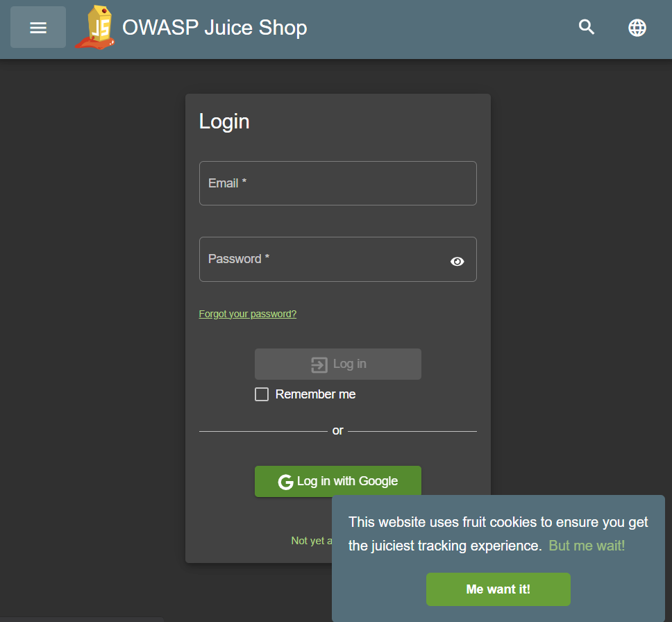

# SQL Injection (SQLi) Exploit

---

## **Overview**

**SQL Injection** is a web security vulnerability that allows an attacker to interfere with the queries that an application makes to its database. This attack was performed on the login form of OWASP Juice Shop.

---

## **Steps Performed**

1. **Identify the Target**:
   - Navigated to the login page of Juice Shop.

2. **Test for Vulnerability**:
   - Entered the following payload in the **Email** field:
     ```
     ' OR 1=1--
     ```
   - Entered the following payload in the **Password** field:
     ```
      1234
     ```
   - Observed that the application allowed login without valid credentials, indicating a successful SQL Injection.

3. **Payload Explanation**:
   - The payload `' OR 1=1--` works by:
     - `'`: Closes the query's original string.
     - `OR 1=1`: Always evaluates to true.
     - `--`: Comments out the rest of the query.

4. **Results**:
   - Successfully bypassed authentication and logged in as an admin or other user.

---

## **Screenshots**

- **Vulnerable Login Form**:
  

- **Injected Payload**:
  


- **Result After Injection**:
  

---

## **Mitigation Techniques**

1. **Sanitize Input**:
   - Use prepared statements or parameterized queries.
2. **Validate Input**:
   - Ensure that user inputs conform to expected formats.
3. **Use ORMs**:
   - Object-Relational Mapping tools can reduce the risk of SQL Injection.
