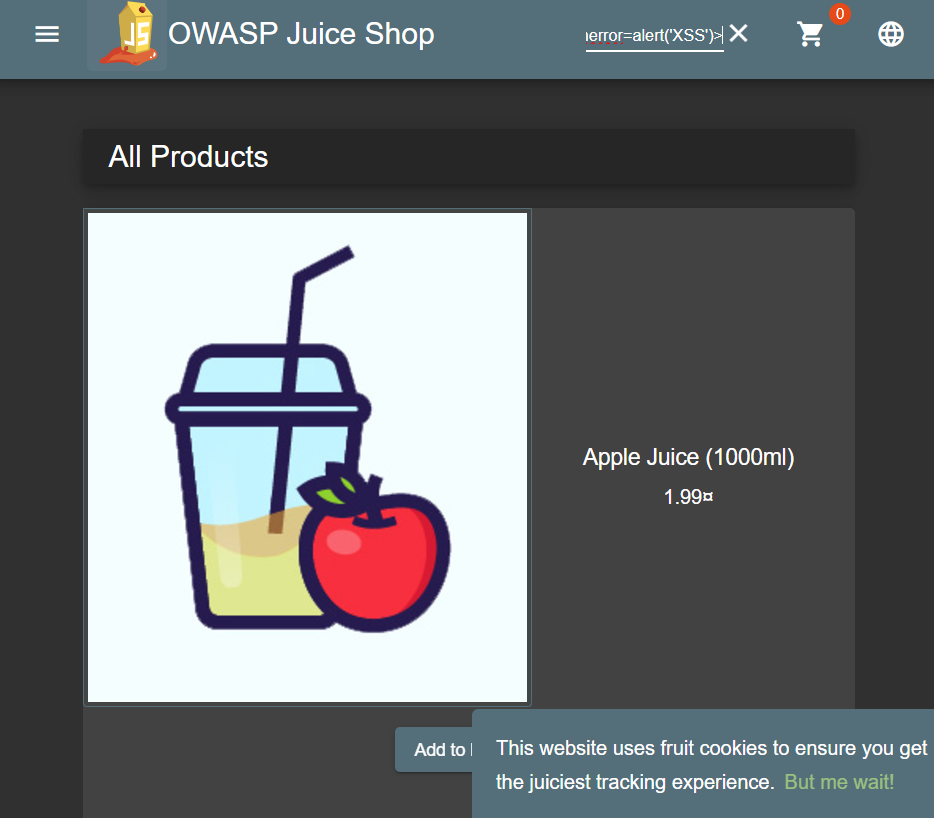
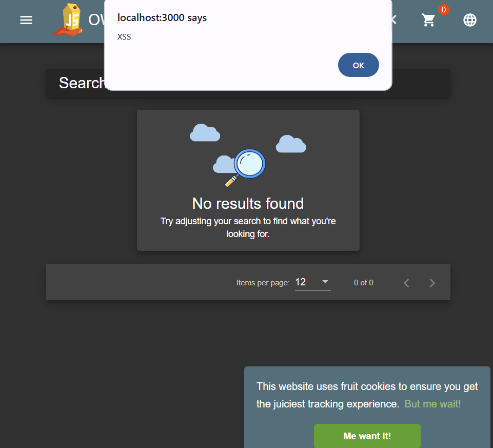

# Cross-Site Scripting (XSS) Exploit

---

## **Overview**

**Cross-Site Scripting (XSS)** is a vulnerability that allows an attacker to inject malicious scripts into web pages viewed by users. This attack was performed on a feedback/comment form in OWASP Juice Shop.

---

## **Steps Performed**

1. **Identify the Target**:
   - Navigated to the Search box on Juice Shop.

2. **Test for Vulnerability**:
   - Injected the following payload in the feedback comment box:
     ```html
     
     ```
   - Submitted the form.

3. **Payload Explanation**:
   - ``:
     - Creates an image element with a broken source (`src=x`).
     - Triggers the `onerror` event, which executes `alert('XSS')`.

4. **Results**:
   - A popup alert was displayed when the feedback was rendered, confirming a successful XSS attack.

---

## **Screenshots**

- **Injected Payload**:
  

- **Result (Alert Box)**:
  

---

## **Mitigation Techniques**

1. **Escape User Input**:
   - Use libraries to escape special characters in user inputs.
2. **Use Content Security Policy (CSP)**:
   - Define strict rules for what scripts can execute.
3. **Sanitize Input**:
   - Remove or encode dangerous HTML/JavaScript content from user inputs.
